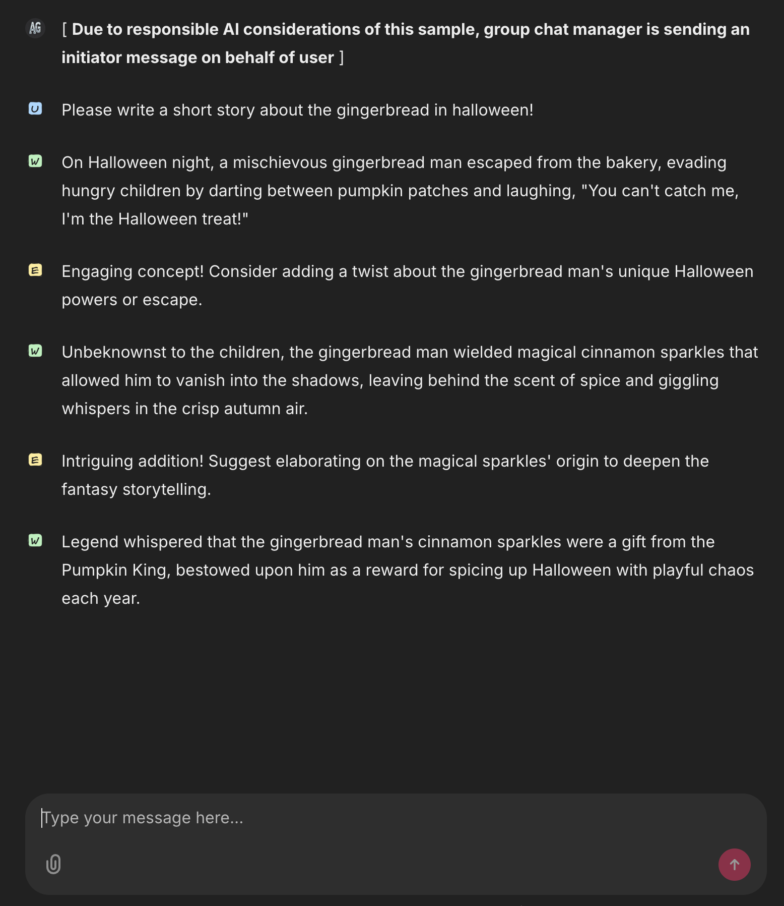

# Multi agent distributed orchestration using Autogen

## Prerequisites

- `uv` - [[install]](https://docs.astral.sh/uv/getting-started/installation/)
- `tmux` (required only if running with run.sh) - [[install]](https://github.com/tmux/tmux?tab=readme-ov-file#installation)

## Usage

1. Create the virtual environment and install dependencies using `uv sync`.
2. Add your OpenAI endpoint and API key to `src/config.yaml`.
3. Call `./run.sh` to start the distributed group chat in tmux and open the UI in your browser.
4. After you're done, call `./stop.sh` to stop the distributed group chat in tmux.

On the UI (and in the terminal), you can observe the agents collaborate on the given task.
They continue until the group chat manager considers the task is complete.

